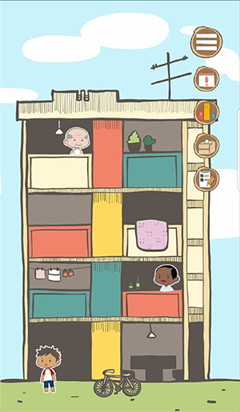
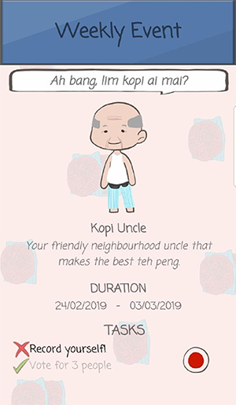
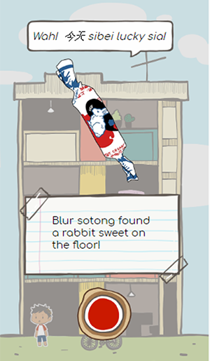

## Hackomania 2019 Submission - AI Challenge
# CakapTalk
---
Andre Hadianto Lesmana | Nikos Chan Wai | Tan Jia Qi Claire | Tay Tzu Shieh | Yee Celine

### Problem
Singapore authorities and organisations are attempting to develop a speed-to-text model using
Singlish speech. However, the dataset of transcribe Singlish is very limited and hiring workers to 
transcribe manually is very expensive. CakapTalk aims to gamify the process of crowdsourcing to 
gamify the process of crowdsourcing to facilitate the collection of both Singlish speech and the 
corresponding transcribed data.

### CakapTalk
CakapTalk is a AndroidApp Studio-based game, most of the assets and characters were handdrawn using 
Adobe Photoshop and AdobeIllustrator Draw during the 24-hour period of the hackathon. Players can 
record their voices following the Singlish phrases in text available in the game. Upon completing 
certain tasks, players will unlock stickers and characters. There are two avenues for collecting
stickers - event and hidden. Event phrases will expire after a certain period (ie. after a day or 
week or when the holiday ends) Hidden phrases will be uncovered by random.
 
The game's main platform is mobile, making it very convenient to download and play the game at 
anytime and anywhere. It is also a casual Idle game where players can play at their own pace. 
However, players will be incentivised by the cute stickers and the drive to complete the collection.

### Preview

#### Sample Collectibles

 

### Features
* Cute handdrawn assets and characters
* Collect over 50 different characters and see them roaming around your very own HDB block on the 
homepage
* Listen to others' interpretation of the phrases and vote for the ones you like the most!
* Leaderboard, compete with others to get bonus prizes
